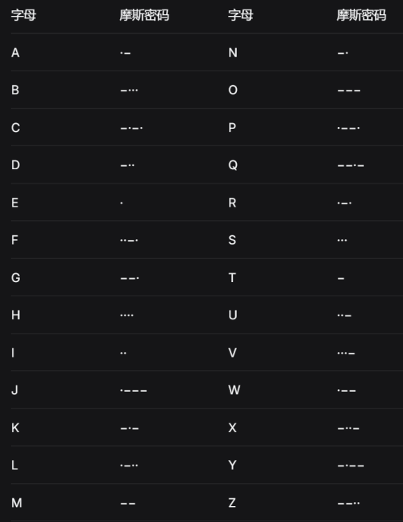
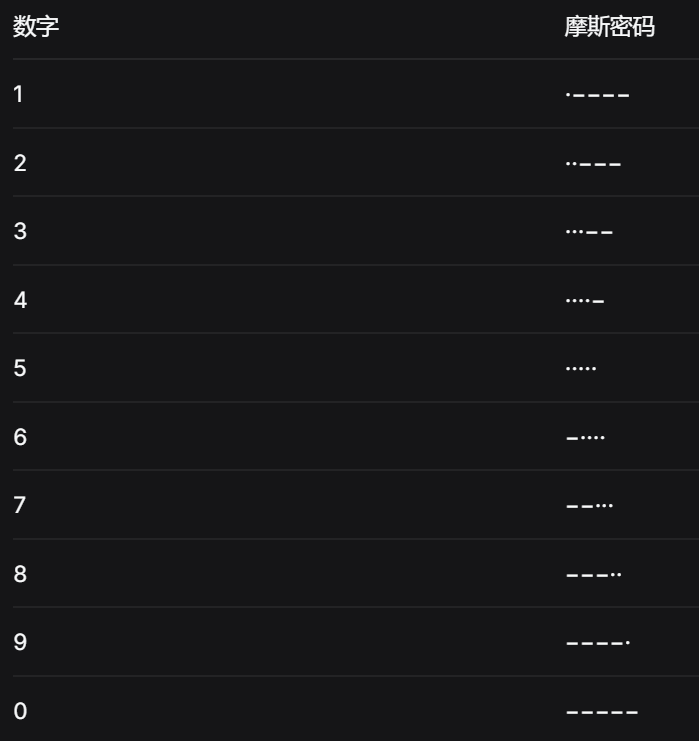

小程序需求

剧情部分：

### 剧情树（原图转写）

- 小程序
  - 1937
    - 第一章：入局·潜伏之路
      - 序幕：入党·北平往事（1936.12—1937年6月下旬）
        - 接受任务（清华园气象台地下室）
        - 一、离校准备：收拾行李（宿舍）
        - 二、出校门：通过检查（校门）
        - 三、登车时刻：火车站的考验（车站）
      - 第一回：烽火骤起·失联（1937.7.7—1937年10月底）
        - 一、客厅询变·交叉询问（客厅）
        - 二、寝友无眠·母之慰念（卧室）
        - 三、报端寻迹·南至消息（街头）
        - 四、尺素传情·长沙方向（客厅）
        - 五、深夜摊牌·交叉询问（客厅）
        - 六、启程前夕·双亲的暗语（卧室）
        - 七、江畔送别·双轨结算（码头）
      - 第二回：棋劫初布·长沙临时大学（1937.11.1前后—1937.12.13的几天后）
        - 一、校园徘徊·无人相识（联大校园）
        - 二、暗夜接头·请缨赴安（图书馆）
        - 三、金陵陷落·茶馆承命（联大宿舍）
        - 四、茶馆接头（茶馆）
      - 第三回：报名服务团·伪装身份（1937年12月下旬）
        - 报名（湖南青年战地服务团报名点）
      - 第四回：暗流试锋·西北征途（1937年12月下旬—1938年1月下旬）
        - 一、站台北上（车站）
        - 二、列车上的第一次较量（火车上）
        - 三、朝宗南的面试（会客室）
        - 四、武昌八路军办事处（董必武办公室）
        - 五、向西·踏上征途
    - 第二章
    - 第三章
    - 第四章
  - 1948
  - 1983
  - 2022

要求：

·完成剧本剧情安排，确保每个选项剧情连贯

·在地图上一个章节一个节点

·章节之间数值继承

·在剧本对应节点判断游戏是否失败

·对话时出现对应背景和人物

·人物初次出现显示人物名片（背包可以查看已收集的人物名片） <https://khsj.cn/l6wswtpm6lmepxh>

·游戏存档，任务失败从当前章节重新开始，下一次登录记住之前的进度

·存档玩家羽毛、道具等数值

·玩家可在背包中查看自己获得的道具和解锁的人物

玩法部分（贯穿所有世界）：

1.国安题库：每天1道题，回答正确可以获得n个羽毛

3.商城：兑换原地复活卡（重新回答当前问题）？触底反弹卡（比如说怀疑值达到临界可以-5）？探索卡（可以获得1个小时的任意关卡探索时间）……

3.情报站：

情报碎片：可以用羽毛换。集齐了可以换情报碎片（拼图的形式）--\>人物身份档案---\>触发鉴别玩法

情报发送站：给出26个字母对应的摩斯密码，在规定时间用摩斯密码发送指定信息可以获得一个宝箱（宝箱里面有剧情碎片/羽毛/技能卡）

